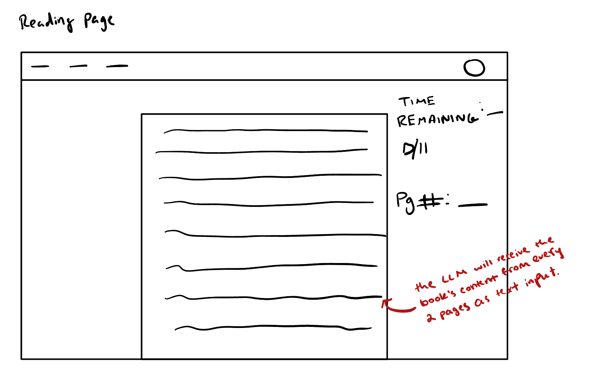
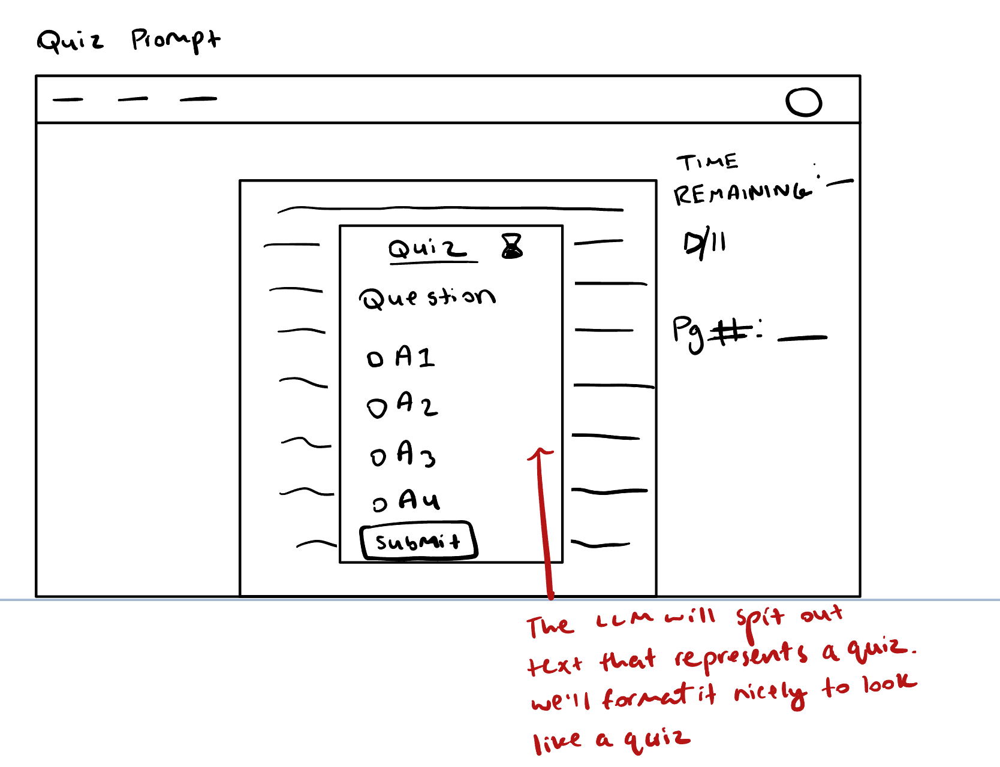
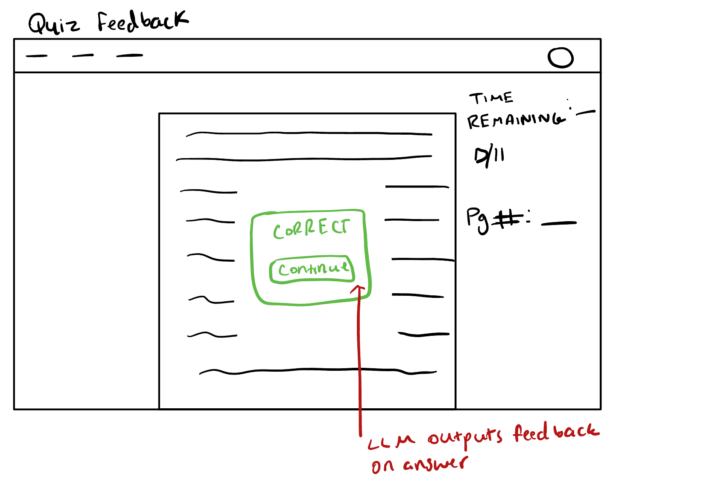

# QuizRead

## Augment the design of a concept

### Original Concept

```
concept CheckpointQuiz [User, Content]
purpose quiz the reader on recently read content to maintain attention
principle after reading 2 pages, a multiple-choice quiz tests comprehension and feedback

state
  a set of Quizzes with
    a content Content
    a question String
    a set of answers String
    a correctAnswer String

  a set of QuizAttempts with
    a user User
    a quiz Quiz
    a selectedAnswer String
    a isCorrect Boolean

actions
  createQuiz (content: Content) : (quiz: Quiz)
    effect creates a quiz with a question and multiple-choice answers

  submitQuizAnswer (user: User, quiz: Quiz, answer: String) : (attempt: QuizAttempt)
    effect records user’s answer and whether it was correct
```

### AI Augmented Version

```
concept CheckpointQuiz [User, Content]
purpose quiz the reader on recently read content to maintain attention
principle after reading 2 pages, a multiple-choice quiz tests comprehension and feedback

state
  a set of Quizzes with
    a content Content
    a question String
    a set of answers String
    a correctAnswer String

  a set of QuizAttempts with
    a user User
    a quiz Quiz
    a selectedAnswer String
    a isCorrect Boolean

actions
  createQuiz (content: Content) : (quiz: Quiz)
    requires content to not be empty
    effect sends the content to an LLM to generate a relevant question and four multiple-choice answers

  submitQuizAnswer (user: User, quiz: Quiz, answer: String) : (attempt: QuizAttempt)
    effect records user’s answer and whether it was correct
```

## Design the user interaction





### User Journey

A user is trying to read their book for a class assignment. Unfortunately, they get distracted when reading and often have to reread pages multiple times, wasting time and effort. They search for ways to maintain their focus while reading and discover the concept of active reading. They find our app, QuizRead, and log in. They see the option to upload a digital version of their book, so they do so. After reading every 2 pages, they click to go to the next page, but a quiz pops up about those pages. The user has to select one of the four answers, and after submitting, they receive feedback about their answer.

## Explore richer test cases and prompts

### Experiment 1: Noisy prose output to JSON-only prompt

Approach: I used a fake LLM that adds extra commentary/notes around the answer to break the baseline line-oriented parser, then retried the same content with a STRICT JSON-only prompt variant.

What worked: The JSON variant produced a clean, machine-parseable object on the first try, and the JSON-first parsing path extracted question, answers, and correctAnswer reliably.

What went wrong: The baseline prompt is brittle. Any extra prose or markdown after the “Correct Answer” line causes a format validation failure.
Issues that remain: Models can still emit malformed JSON like stray commas and trailing prose.

### Experiment 2: Wrong number of answers to Constrained template

Approach: I made the fake LLM return five options with the baseline prompt to trigger the “exactly four answers” validation error, then switched to a constrained prompt that explicitly requires “EXACTLY FOUR” mutually exclusive options.

What worked: The constrained template reliably yielded four options, passing the strict count and inclusion checks.

What went wrong: The baseline prompt does not enforce the cardinality requirement, so it failed validation as intended.
Issues that remain: The occasional non-compliance is still possible. What we can possibly do is if answers.length !== 4, send a follow-up regeneration prompt with the same constraints.

### Experiment 3: Correct answer missing from options to Constrained template

Approach: I forced a mismatch where correctAnswer wasn’t in answers, then I used a constrained prompt that requires copying the correct answer verbatim into the options list.

What worked: The constrained template fixed the invariant. correctAnswer appeared exactly in answers, and validation passed.

What went wrong: The baseline prompt lacks this invariant, so it failed when the model drifted.
Issues that remain: Even with constraints, subtle phrasing changes can occur like abbreviations.

## Add validators to your code

**Plausible issue 1**: Duplicate or empty answers reduce quiz quality and can make the correct option ambiguous. Validator: ensure exactly four non-empty, concise answers with no duplicates. Implemented in validateAnswersUniquenessAndNonEmpty and called from createQuiz.

**Plausible issue 2**: Trick/catch‑all options like “All of the above” or “None of the above” isn't an answer choice I want in the quizzes. Validator: reject banned catch‑all phrasings. Implemented in validateNoTrickCatchAllOptions and enforced in createQuiz.

**Plausible issue 3**: Ungrounded questions/answers that don’t reference the provided content (hallucinations). Validator: require lexical overlap between the content and either the question or the correct answer using simple keyword extraction. Implemented in validateGrounding and enforced in createQuiz.
